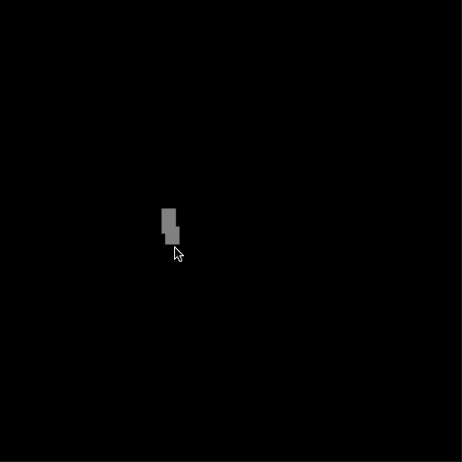

# websand

Websand is a simple JavaScript/WebGL implementation of a [falling sand game](https://en.wikipedia.org/wiki/Falling-sand_game) which I made in a few hours. It is an extremely unpolished but reasonably functional prototype. I may clean this up one day.

To test, serve `sand.html` and load it in a browser. Click buttons to select elements and click and drag on the canvas to draw with the selected element.

You can also try this demo online at [pineapplemachine.com](http://pineapplemachine.com/demos/websand/sand.html).

Websand depends on [twgl](https://twgljs.org/).

